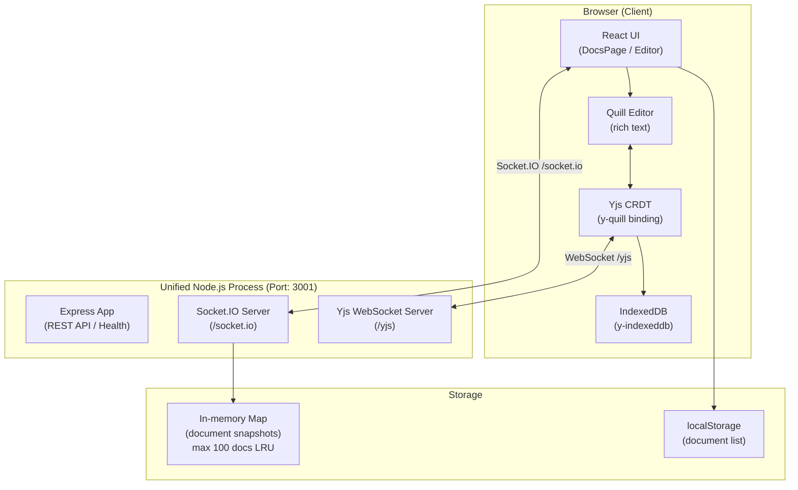

# Collaborative Docs

> A real-time, multi-user document editor inspired by Google Docs — built with React, Quill, Yjs CRDTs, and WebSockets.


---

## ✨ Features

| Category | Details |
|---|---|
| **Real-time collaboration** | Conflict-free concurrent editing via Yjs CRDT; changes sync instantly across all connected users |
| **Live presence** | Collaborator avatars (other peers only), active typing indicator, shared named cursors with per-user colours; departed peers are removed immediately |
| **Document title sync** | Renaming a document in the editor title bar broadcasts the new name to all open tabs via Yjs awareness in real time |
| **Rich text editing** | 13 Google Fonts, 15 font sizes (8 pt – 72 pt), bold/italic/underline/strike, colour & highlight, alignment, ordered & bullet lists, indentation, hyperlinks |
| **Document management** | Create (with custom name, shown immediately in editor), rename, search, delete — all via polished inline modals (no browser `prompt()`) |
| **Offline support** | IndexedDB persistence via `y-indexeddb`; reconnects and re-syncs automatically |
| **Export** | One-click PDF export (`html2pdf.js`) and DOCX export (`file-saver`) |
| **Word / character count** | Live counter in the editor status bar |
| **Responsive UI** | Works on desktop, tablet, and mobile |

---

## 🏗️ Architecture



> **Single Server Process**:
> The backend has been refactored into a single Node.js process (on port 3001) exposing:
> - Express REST API and `/health` route
> - Socket.IO endpoints on `/socket.io` for coarse-grained events (join, save)
> - Yjs WebSocket sync server on `/yjs` for conflict-free real-time CRDT updates

---

## 📁 Project Structure

```
collaborative-text-editor/
│
├── client/                         # Vite + React frontend
│   ├── index.html                  # App entry — Google Fonts, SEO meta tags
│   ├── vite.config.js
│   ├── package.json
│   └── src/
│       ├── main.jsx                # React DOM root (StrictMode intentionally omitted — see Compatibility Notes)
│       ├── App.jsx                 # Router: / → DocsPage, /:id → Editor
│       ├── index.css               # Design system (tokens, fonts, Quill overrides)
│       │
│       ├── components/
│       │   ├── DocsPage.jsx        # Home screen — document list, search, create/delete modal
│       │   └── Editor.jsx          # Main editor — Quill + Yjs binding, toolbar, export
│       │
│       ├── services/
│       │   ├── storage.js          # localStorage helpers (getDocs / saveDocs)
│       │   └── yjsProvider.js      # Creates Y.Doc + IndexeddbPersistence + WebsocketProvider
│       │
│       └── utils/
│           └── generateId.js       # Deterministic slug ID from document name
│
└── server/                         # Node.js + Express + Socket.IO + Yjs unified backend
    ├── index.js                    # Main server — CORS, socket events, document store, Yjs WebSocket handler
    └── package.json
```

---

## ⚙️ Getting Started

### Prerequisites

| Tool | Minimum version |
|---|---|
| Node.js | 18.x |
| npm | 9.x |

### 1 — Clone

```bash
git clone https://github.com/Bhavadharani412/collaborative-text-editor.git
cd collaborative-text-editor
```

### 2 — Install dependencies

```bash
# Frontend
cd client
npm install

# Backend (new terminal)
cd ../server
npm install
```

### 3 — Start the backend server

The unified server runs the Express app, Socket.IO, and the Yjs WebSocket server concurrently.

```bash
# Inside /server
npm run dev          # auto-restarts on file changes (node --watch)
# or
npm start            # production
```

### 4 — Start the React app

```bash
# Inside /client
npm run dev
```

Open **http://localhost:5173** in your browser.

---

## 🌍 Environment Variables

### Client (`client/`)

For local development, create a `client/.env.local` file:

```env
VITE_API_URL=http://localhost:3001
VITE_YJS_URL=ws://localhost:3001/yjs
```

For production (e.g. Vercel):

```env
VITE_API_URL=https://collaborative-text-editor-lhta.onrender.com
VITE_YJS_URL=wss://collaborative-text-editor-lhta.onrender.com/yjs
```

### Server (`server/`)

| Variable | Default | Description |
|---|---|---|
| `PORT` | `3001` | Server listen port |
| `CLIENT_ORIGIN` | `http://localhost:5173` | Allowed CORS origin for the frontend |

Create a `server/.env` file (optional):

```env
PORT=3001
CLIENT_ORIGIN=http://localhost:5173
```

---

## 🔄 Real-Time Sync Flow

```
User types in Quill
      ↓
Quill text-change event
      ↓
Yjs CRDT merges the delta locally (conflict-free)
      ↓
y-websocket sends the update to the relay server (port 1234)
      ↓
Relay broadcasts the delta to all peers in the same document room
      ↓
Other clients apply the delta via Yjs (IndexedDB also updated)
      ↓
Quill re-renders the updated document
```

---

## 🧩 Key Modules

### `client/src/components/Editor.jsx`
The heart of the application. Responsibilities:
- Registers custom Quill font and size formats using the **Quill v2 attributor paths**
  (`attributors/class/font`, `attributors/class/size`) so CSS classes are emitted instead
  of inline styles — this is what makes the font-size CSS rules actually apply
- Font sizes use **pt units** (8 pt – 72 pt) matching standard document conventions
- Mounts Quill with a full Google Docs-style toolbar (13 fonts, 15 sizes)
- Connects to Yjs via `createYjs()` and binds with `QuillBinding`
- Manages Yjs `awareness` for live cursor and typing presence; filters out the local
  client so avatar count only shows *other* collaborators; cleans up cursors when peers leave
- **Title sync** — title input changes are broadcast via `awareness.setLocalStateField("docTitle", …)`;
  peer tabs receive the update and persist it to localStorage immediately
- Document name is read via **lazy `useState` initialiser** (`() => loadDocName(id)`) so
  the correct name appears on first render with no flash of "Untitled document"
- Renders a topbar with back navigation, editable title, avatar list, connection badge,
  mode toggle, and export buttons
- Tracks word and character count in real time

### `client/src/components/DocsPage.jsx`
Document home screen. Responsibilities:
- Lists all documents stored in localStorage
- Full-text search across document names
- Inline modal for creating new documents (replaces `window.prompt`)
- Confirmation modal for deletes
- Colour-coded document cards with relative timestamps

### `client/src/services/yjsProvider.js`
Creates and configures the Yjs collaboration stack:
- `Y.Doc` — the shared CRDT document
- `IndexeddbPersistence` — local offline persistence
- `WebsocketProvider` — real-time sync via the y-websocket relay

### `server/index.js`
Express + Socket.IO signalling server:
- `/health` endpoint (uptime, document count)
- `join-document` → joins room, sends current snapshot
- `send-changes` → relays delta to all other clients in the room
- `save-document` → stores snapshot in memory (LRU cap: 100 documents)
- CORS restricted to `CLIENT_ORIGIN`
- Graceful SIGTERM/SIGINT shutdown

---

## 🖥️ Supported Fonts

Font sizes range from **8 pt to 72 pt** (in standard document pt units). The size picker
labels override Quill's built-in `content: 'Normal'` rule using higher-specificity CSS
selectors, and each item previews its own size in the dropdown.

| Font | Category |
|---|---|
| Arial | Sans-serif |
| Times New Roman | Serif |
| Roboto | Sans-serif |
| Open Sans | Sans-serif |
| Lato | Sans-serif |
| Montserrat | Sans-serif |
| Poppins | Sans-serif |
| Raleway | Sans-serif |
| Ubuntu | Sans-serif |
| Playfair Display | Display serif |
| Merriweather | Serif |
| Source Code Pro | Monospace |
| Nunito | Rounded sans-serif |

---

## 🔧 Available Scripts

### Client (`client/`)

| Script | Description |
|---|---|
| `npm run dev` | Start Vite dev server (hot reload) |
| `npm run build` | Build production bundle |
| `npm run preview` | Preview production build locally |
| `npm run lint` | Run ESLint |

### Server (`server/`)

| Script | Description |
|---|---|
| `npm start` | Start server with `node index.js` |
| `npm run dev` | Start with `node --watch` (auto-restart) |

---

## 🚧 Known Limitations & Future Improvements

- **Persistence** — Document content lives in server memory and resets on restart. A future version should persist to MongoDB, PostgreSQL, or Redis.
- **Authentication** — No user accounts yet. Users receive auto-generated ephemeral names.
- **Shareable links** — Document IDs are already URL-friendly; sharing is already possible by copying the URL.
- **Version history** — Yjs supports snapshotting; this can be added without a database.
- **Comments & suggestions** — Planned via Yjs shared types.
- **Dark mode** — CSS variables are already in place; a theme toggle can be added trivially.
- **Role-based permissions** — Read-only / edit access via awareness metadata.

---

## ⚠️ Compatibility Notes

### React StrictMode

`StrictMode` is **intentionally not used** in [`src/main.jsx`](./client/src/main.jsx).

In development, React StrictMode double-invokes `useEffect` to detect side effects. This
creates **two Yjs WebSocket providers per browser tab**, each with a unique client ID.
With two real tabs open, Yjs awareness then reports four connected clients — showing
ghost collaborator avatars that don't exist.

Quill's imperative DOM setup also does not survive the double-mount/unmount cycle cleanly.

If you need StrictMode for a specific reason, isolate the Quill + Yjs initialisation behind
a ref guard so the provider is only created once.

### Quill v2 Attributor Paths

Quill 2.x changed how formats are registered. The correct import paths are:

```js
// ✅ Quill 2.x — class-based attributors
const FontClass = Quill.import('attributors/class/font');
const SizeClass = Quill.import('attributors/class/size');

// ❌ Quill 1.x style (still exists but returns wrong object in v2)
const Font = Quill.import('formats/font');
```

Using `attributors/class/size` causes Quill to emit `class="ql-size-12pt"` on text spans,
which our CSS rules in `index.css` then match. Using the old path causes Quill to write
inline `style="font-size: 12pt"` which bypasses the CSS class system and makes the size
picker show `Normal` for every option (Quill's snow.css default wins at higher specificity).

---

## 🤝 Contributing

1. Fork the repository
2. Create a feature branch: `git checkout -b feat/your-feature`
3. Commit your changes: `git commit -m 'feat: add your feature'`
4. Push: `git push origin feat/your-feature`
5. Open a Pull Request

Please follow the [Conventional Commits](https://www.conventionalcommits.org/) specification.

---

## 📄 License

[MIT](./LICENSE) © Bhavadharani412
